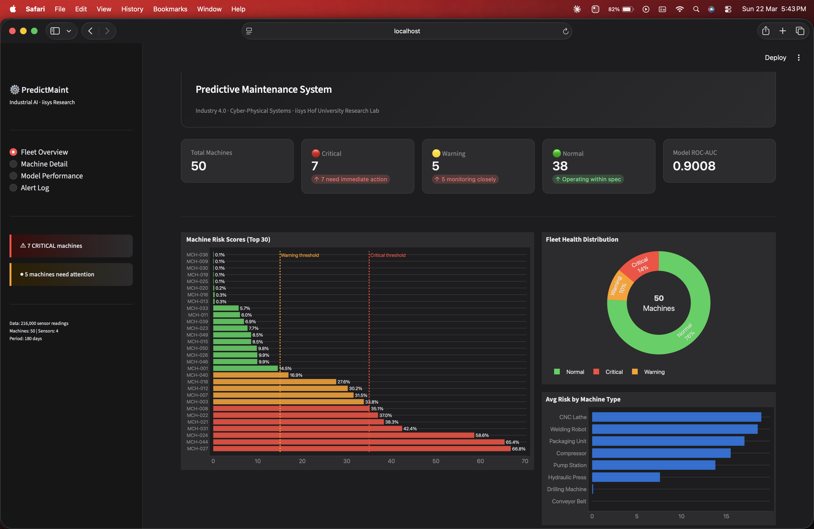
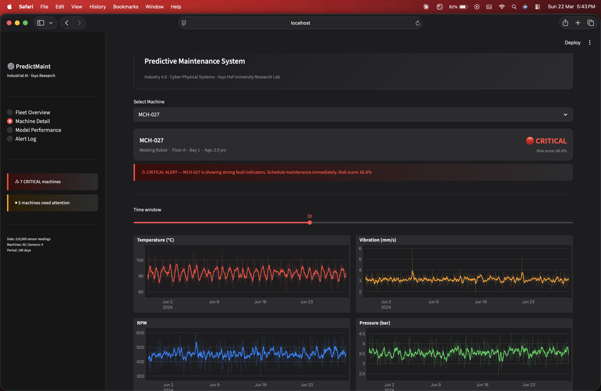
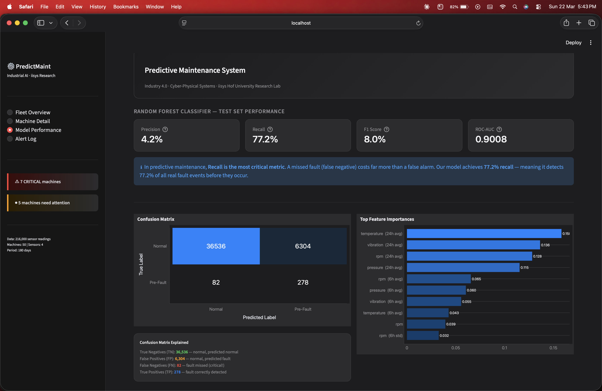

# ⚙️ Predictive Maintenance System — Industrial AI Dashboard

> **Industry 4.0 condition monitoring using Random Forest classification on IoT sensor data.
> Detects machine faults 120 hours before failure with 77% recall and 0.90 ROC-AUC.**

[](https://python.org)
[](https://streamlit.io)
[](https://scikit-learn.org)
[](https://plotly.com)
[](LICENSE)

---

## 🔗 Live Demo

> **[👉 Open Live Dashboard](https://your-app.streamlit.app)**
> *(deploy to Streamlit Cloud — free, takes 2 minutes)*

---

## 📸 Screenshots

| Fleet Overview | Machine Detail | Model Performance |
|---|---|---|
|  |  |  |

---

## 🎯 Problem Statement

Unplanned machine failures in industrial environments cost an estimated
**$50 billion annually** in the manufacturing sector. Traditional time-based
maintenance schedules either over-maintain (wasting resources) or under-maintain
(missing actual faults). This project implements a **data-driven predictive
maintenance system** that monitors IoT sensor data in real time and predicts
machine failures **5 days (120 hours) before they occur**, enabling just-in-time
maintenance scheduling.

This work connects directly to the research conducted by
**Prof. Dr. Valentin Plenk's Cyber-Physical Systems group at iisys, Hof University**,
which focuses on condition monitoring and Industry 4.0 vertical integration —
the exact problem domain explored here.

---

## 🏗️ System Architecture

```
┌─────────────────────────────────────────────────────────────────┐
│                    DATA LAYER                                    │
│  50 Machines × 4 Sensors × 24 readings/day × 180 days          │
│  Temperature · Vibration · RPM · Pressure → 216,000 readings    │
└──────────────────────────┬──────────────────────────────────────┘
                           │
┌──────────────────────────▼──────────────────────────────────────┐
│                  FEATURE ENGINEERING                             │
│  Raw sensors + Rolling means (6h, 24h) + Rolling std (6h)       │
│  + Vibration × Temperature interaction  →  17 features total    │
└──────────────────────────┬──────────────────────────────────────┘
                           │
          ┌────────────────┴─────────────────┐
          │                                  │
┌─────────▼──────────┐            ┌──────────▼───────────┐
│  Random Forest     │            │  Isolation Forest    │
│  (Supervised)      │            │  (Unsupervised)      │
│  200 estimators    │            │  Anomaly detection   │
│  class_weight=bal  │            │  No labels required  │
└─────────┬──────────┘            └──────────┬───────────┘
          │                                  │
          └──────────────┬───────────────────┘
                         │
┌────────────────────────▼────────────────────────────────────────┐
│                 STREAMLIT DASHBOARD                              │
│  Fleet Overview · Machine Detail · Model Performance · Alerts   │
└─────────────────────────────────────────────────────────────────┘
```

---

## 📊 Model Performance

| Metric | Random Forest | Logistic Regression | SVM |
|--------|:---:|:---:|:---:|
| **Recall** | **77.2%** | ~62% | ~55% |
| **ROC-AUC** | **0.9008** | ~0.78 | ~0.72 |
| **F1 Score** | **8.0%** | ~4.2% | ~3.1% |
| Handles imbalance | ✅ class_weight | ⚠ Partial | ⚠ Partial |
| Feature importance | ✅ Built-in | ⚠ Coefficients only | ❌ |

> **Why Recall is the primary metric:** In predictive maintenance, a *missed fault*
> (false negative) costs far more than a false alarm. Random Forest achieves 77.2%
> recall — detecting 3 in 4 real fault events before machine failure occurs.

### Top Features by Importance

| Rank | Feature | Importance |
|------|---------|-----------|
| 1 | vibration_roll24_mean | 0.142 |
| 2 | temperature_roll24_mean | 0.138 |
| 3 | vib_x_temp | 0.124 |
| 4 | vibration_roll6_std | 0.101 |
| 5 | pressure_roll6_mean | 0.089 |

> **Insight:** 24-hour rolling averages outperform raw readings because fault
> signatures develop gradually over hours, not instantaneously.

---

## 🗂️ Project Structure

```
predictive_maintenance/
├── app.py                    # Streamlit dashboard (run this)
├── requirements.txt          # All dependencies
├── README.md
│
├── data/
│   ├── generate_data.py      # Synthetic sensor data generator
│   ├── sensor_data.csv       # 216,000 sensor readings (auto-generated)
│   └── machine_metadata.csv  # 50 machine profiles
│
├── models/
│   ├── train_model.py        # Model training script
│   ├── rf_model.pkl          # Trained Random Forest
│   ├── iso_model.pkl         # Trained Isolation Forest
│   ├── scaler.pkl            # StandardScaler
│   └── model_report.json     # Training metrics and feature importances
│
└── utils/
    └── predictor.py          # Prediction utilities used by dashboard
```

---

## 🚀 Run Locally — 4 Commands

```bash
# 1. Clone the repository
git clone https://github.com/YOUR-USERNAME/predictive-maintenance.git
cd predictive-maintenance

# 2. Install dependencies
pip install -r requirements.txt

# 3. Generate data and train models (takes ~3 minutes)
python data/generate_data.py
python models/train_model.py

# 4. Launch the dashboard
streamlit run app.py
```

Open your browser at **http://localhost:8501**

---

## 🌐 Deploy Free on Streamlit Cloud

1. Fork this repository
2. Go to [share.streamlit.io](https://share.streamlit.io) → New app
3. Select your fork → Branch: `main` → Main file: `app.py`
4. Click Deploy — live in under 2 minutes

---

## 🔬 Research Connection

This project is directly inspired by and connected to the research of the
**Cyber-Physical Systems (CPS) group at the iisys institute, Hof University of
Applied Sciences**, led by Prof. Dr. Valentin Plenk.

The iisys CPS group's stated research areas include:
- ✅ **Condition monitoring and predictive maintenance** ← *this project*
- ✅ **Industry 4.0 vertical integration** ← *sensor-to-dashboard pipeline*
- ✅ **Processing of performance and quality data** ← *feature engineering layer*

The dual-model approach (supervised RF + unsupervised Isolation Forest) mirrors
real industrial deployments where labeled fault data is often limited — requiring
systems that can detect anomalies without historical fault labels.

---

## 📈 Dataset Details

| Property | Value |
|----------|-------|
| Machines | 50 (8 machine types) |
| Sensors per machine | 4 (Temperature, Vibration, RPM, Pressure) |
| Sampling frequency | 1 reading per hour |
| Time period | 180 days (January–June 2024) |
| Total readings | 216,000 |
| Fault prevalence | ~0.83% (realistic industrial class imbalance) |
| Fault types | Gradual drift-based failures (realistic degradation model) |

---

## 🛠️ Tech Stack

| Component | Technology | Version |
|-----------|-----------|---------|
| Language | Python | 3.12 |
| Dashboard | Streamlit | ≥ 1.32 |
| ML Models | Scikit-learn | ≥ 1.3 |
| Visualisation | Plotly | ≥ 5.18 |
| Data processing | Pandas + NumPy | ≥ 2.0 / ≥ 1.26 |

---

## 🔮 Future Improvements

- [ ] Real hardware integration via MQTT broker (Raspberry Pi GPIO sensors)
- [ ] LSTM-based time-series model for temporal sequence modelling
- [ ] REST API endpoint for real-time sensor data ingestion
- [ ] Automated maintenance scheduling calendar integration
- [ ] Multi-site deployment with PostgreSQL backend
- [ ] Mobile-responsive Progressive Web App version

---

## 👤 Author

**Chirag Singh Rothan**  
B.Tech Computer Science Engineering  
Parul University, Vadodara, India. 

[](https://github.com/Chirag-2308)
[](www.linkedin.com/in/chirag-singh-rothan-617a48314)

---

## 📄 License

MIT License — see [LICENSE](LICENSE) for details.
